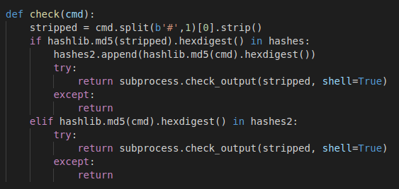
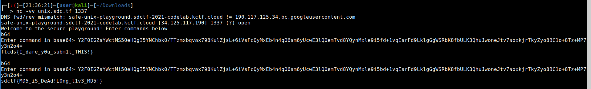

### MD5 Collider => \# Destruction

#### The most interesting part of the code that suggested that we need MD5 collision is shown below. Also note how the application allows us passing of binary content as base64 encoded input.

* Idea is that anything after the comment `#` should be ignored. We can use this place to come up with random shit after the comment marker such that two different commands before the `#` will still make the same MD5 hash.

Hence, what we are looking for is:

`cat flag-1.txt # <some random things>`

`cat flag-2.txt # <some random things>`
 
Having the same MD5 hash.

To my surprise, there's this MD5 collision algorithm that does exactly this. This algorithm comes up with 2 blocks of data which have only 1 difference: `Bype No 10 is incremented by 1`. Now go back and look at the commands and see that `1 and 2` in the flag-X.txt are actually on the 10th place. :)

Here's more details on the tool and algorithm called Unicall. 
Link goes here.

Next steps are read the documentation and run my little CPU for about half an hour to find the collision. Here are base64 encoded 2 inputs that end up in same md5 hash but have different prefix (commands)

Input 1: MD5 `5453da2c4e406a17abd6e8c8f22fa374`

`Y2F0IGZsYWctMS50eHQgI5YNChbk0/TTzmxbqvax798KulZjsL+6iVsFcQyMxEb4n4qO6sm6yUcwE3lQ0emTvd8YQynMxle9i5fd+1vqIsrFd9LklgGgWSRbK8fbULK3QhuJwoneJtv7aoxkjrTkyZyo8BC1o+8Tz+MP7y3n2o4=`

Input 2: MD5 `5453da2c4e406a17abd6e8c8f22fa374 (SAME as the first!)`

`Y2F0IGZsYWctMi50eHQgI5YNChbk0/TTzmxbqvax798KulZjsL+6iVsFcQyMxEb4n4qO6sm6yUcwE3lQ0emTvd8YQynMxle9i5bd+1vqIsrFd9LklgGgWSRbK8fbULK3QhuJwoneJtv7aoxkjrTkyZyo8BC1o+8Tz+MP7y3n2o4=`

#### Exploitation
1. Pass the first input as base64. This runs successfully as the command after decoding the stripping away the comment & what follows turns out to be `cat flag-1.txt`. Note that this also adds the hash of the actually command (including the comment marker and the binary content that follows). This means that when we send the next command `cat flag-2.txt`, it will be allowed! (The 2nd If condition)

2. Send the second input as base64 to get the flag.

