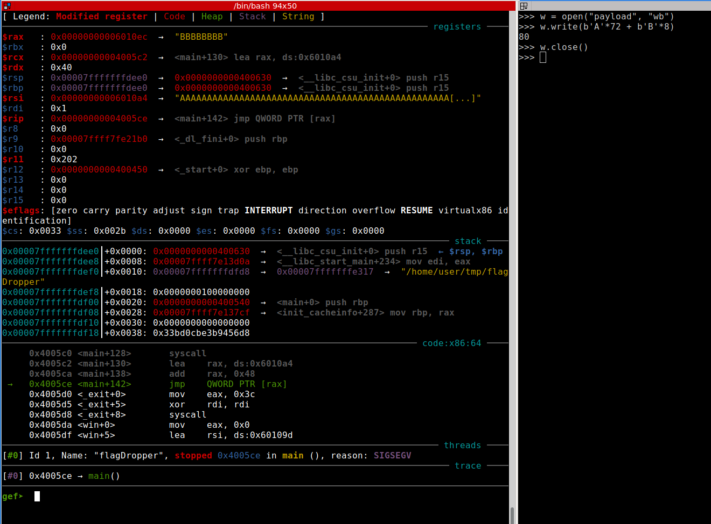
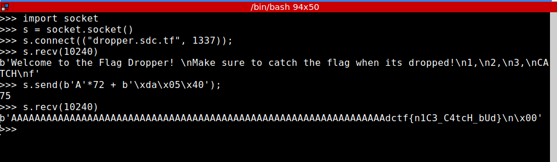

### Classic buffer overflow

#### After printing the funny banner, the binary echoes whatever we pass as input. A nice place to try sending dozens of `A` s :)

* Messing around with the binary, it's clear that after first `72 bytes` of buffer we can pass arbitrary `return address`. We just need to pass the address of the `win` function (`0x4005da`), which exists only to get us the flag ;)

* Sending the payload to fetch the flag...

