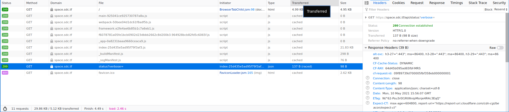
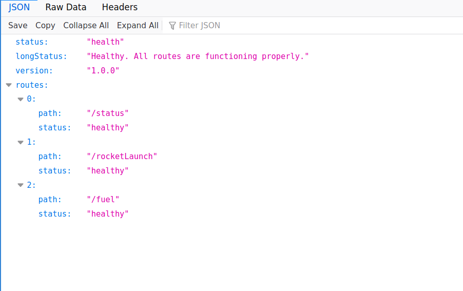
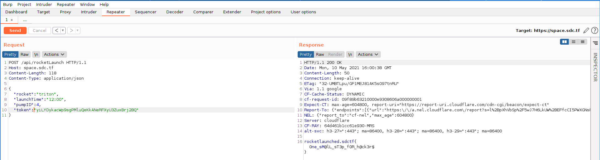

### This challenge was about using frontend to leak information

#### Starting by visiting the url, we see an interesting request being made.

#### Setting verbose=1 provides additional routes available. Routes available

#### Following the debug message provided by the API, we end up with a request that gives up the flag.

* All params except for the token are simply guessing and using available routes of the API. The token parameter is found in one of the js (index-25d435e5ad95f79f3af3.js) loaded by the frontend.
